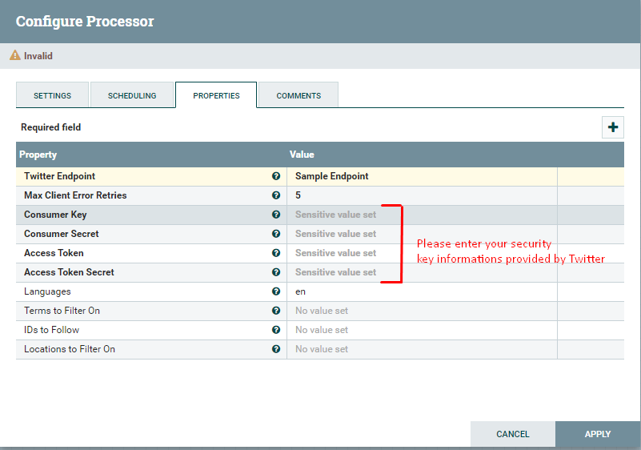

# Twitter Data Ingestion with Apache Nifi

This project includes building a data pipeline for ingesting data from Twitter with Apache Nifi

## Simplified Architecture


## Step 1 - Connect to Twitter

To be able to connect to Twitter API, you need to have API keys that are provided by Twitter. If you are a student and will use this API for educational purposes, you can apply for a free API to Twitter. For more information please check [https://developer.twitter.com/en/docs/twitter-api](https://developer.twitter.com/en/docs/twitter-api).

* [x] We will use GetTwitter processor to connect to Twitter via API.




## Step 2 - Clean & Transform Data

To clean tweet data and extract the desired infoırmation, we will use JoltTransformJson processor.

* [x] Please select JoltTransformJson processor and connect this processor with GetTwitter.


* [x] Enter the jolt spesification written to extract some fields which are "created\_at" , " id", "text", "source", "user.id", "user.name".


```text
#Jolt Spesification
[
  {
    "operation": "shift",
    "spec": {
      "created_at": "created_at",
      "id": "tweet_id",
      "text": "text",
      "source": "source",
      "user": {
        "id": "user_id",
        "name": "name"
      }
    }
  }
  ]
```

## Step 3 - Save Data on Filesystem

We will save outputs into a directory on our host.

* [x] Create a directory to save twitter data

```text
mkdir /home/ubuntu/twitter-data
```

* [x] Be sure that the file has proper permissions. \(Nifi should be able to write into this file\)!!
* [x] Select PutFile processor and connect this with JoltTransformJson


* [x] Please enter your directory path into the processor properties.


## Step 4 - Run Pipeline

* [x] Start all processors in the pipeline.

### Sample Tweet data as an output of GetTwitter Processor

```text
{
  "created_at" : "Fri Jul 09 19:23:53 +0000 2021",
  "id" : 1413579681065062407,
  "id_str" : "1413579681065062407",
  "text" : "RT @emilgaard1: følger alle der rt og liker ❤️❤️ https://t.co/pIPMnIGiOV",
  "source" : "<a href=\"http://twitter.com/download/android\" rel=\"nofollow\">Twitter for Android</a>",
  "truncated" : false,
  "in_reply_to_status_id" : null,
  "in_reply_to_status_id_str" : null,
  "in_reply_to_user_id" : null,
  "in_reply_to_user_id_str" : null,
  "in_reply_to_screen_name" : null,
  "user" : {
    "id" : 1365723275809206283,
    "id_str" : "1365723275809206283",
    "name" : "Its coming Rome🇮🇹",
    "screen_name" : "TheRealHasbulla",
    "location" : "Vejle, Danmark",
    "url" : null,
    "description" : "Epic: Guild Hasbulla\nMoved to 🇩🇰 With @oogwaytert/ Abdu Rozik\nBoxing coach @milt_74",
    "translator_type" : "none",
    "protected" : false,
    "verified" : false,
    "followers_count" : 12,
    "friends_count" : 106,
    "listed_count" : 0,
    "favourites_count" : 442,
    "statuses_count" : 287,
    "created_at" : "Sat Feb 27 18:00:03 +0000 2021",
    "utc_offset" : null,
    "time_zone" : null,
    "geo_enabled" : false,
    "lang" : null,
    "contributors_enabled" : false,
    "is_translator" : false,
    "profile_background_color" : "F5F8FA",
    "profile_background_image_url" : "",
    "profile_background_image_url_https" : "",
    "profile_background_tile" : false,
    "profile_link_color" : "1DA1F2",
    "profile_sidebar_border_color" : "C0DEED",
    "profile_sidebar_fill_color" : "DDEEF6",
    "profile_text_color" : "333333",
    "profile_use_background_image" : true,
    "profile_image_url" : "http://pbs.twimg.com/profile_images/1406854400333725701/f-x-7e5t_normal.jpg",
    "profile_image_url_https" : "https://pbs.twimg.com/profile_images/1406854400333725701/f-x-7e5t_normal.jpg",
    "profile_banner_url" : "https://pbs.twimg.com/profile_banners/1365723275809206283/1624123201",
    "default_profile" : true,
    "default_profile_image" : false,
    "following" : null,
    "follow_request_sent" : null,
    "notifications" : null,
    "withheld_in_countries" : [ ]
  },
  "geo" : null,
  "coordinates" : null,
  "place" : null,
  "contributors" : null,
  "retweeted_status" : {
    "created_at" : "Thu Jul 08 17:19:19 +0000 2021",
    "id" : 1413185945273307141,
    "id_str" : "1413185945273307141",
    "text" : "følger alle der rt og liker ❤️❤️ https://t.co/pIPMnIGiOV",
    "display_text_range" : [ 0, 32 ],
    "source" : "<a href=\"https://mobile.twitter.com\" rel=\"nofollow\">Twitter Web App</a>",
    "truncated" : false,
    "in_reply_to_status_id" : null,
    "in_reply_to_status_id_str" : null,
    "in_reply_to_user_id" : null,
    "in_reply_to_user_id_str" : null,
    "in_reply_to_screen_name" : null,
    "user" : {
      "id" : 1380229249479667712,
      "id_str" : "1380229249479667712",
      "name" : "EMILGAARD LFT",
      "screen_name" : "emilgaard1",
      "location" : null,
      "url" : null,
      "description" : "13 y/o •🟥⬜DANISH•  @FNCompetitive",
      "translator_type" : "none",
      "protected" : false,
      "verified" : false,
      "followers_count" : 147,
      "friends_count" : 311,
      "listed_count" : 0,
      "favourites_count" : 714,
      "statuses_count" : 202,
      "created_at" : "Thu Apr 08 18:41:18 +0000 2021",
      "utc_offset" : null,
      "time_zone" : null,
      "geo_enabled" : false,
      "lang" : null,
      "contributors_enabled" : false,
      "is_translator" : false,
      "profile_background_color" : "F5F8FA",
      "profile_background_image_url" : "",
      "profile_background_image_url_https" : "",
      "profile_background_tile" : false,
      "profile_link_color" : "1DA1F2",
      "profile_sidebar_border_color" : "C0DEED",
      "profile_sidebar_fill_color" : "DDEEF6",
      "profile_text_color" : "333333",
      "profile_use_background_image" : true,
      "profile_image_url" : "http://pbs.twimg.com/profile_images/1401177809314328576/O_nzmjhc_normal.jpg",
      "profile_image_url_https" : "https://pbs.twimg.com/profile_images/1401177809314328576/O_nzmjhc_normal.jpg",
      "profile_banner_url" : "https://pbs.twimg.com/profile_banners/1380229249479667712/1623783806",
      "default_profile" : true,
      "default_profile_image" : false,
      "following" : null,
      "follow_request_sent" : null,
      "notifications" : null,
      "withheld_in_countries" : [ ]
    },
    "geo" : null,
    "coordinates" : null,
    "place" : null,
    "contributors" : null,
    "is_quote_status" : false,
    "quote_count" : 0,
    "reply_count" : 3,
    "retweet_count" : 14,
    "favorite_count" : 30,
    "entities" : {
      "hashtags" : [ ],
      "urls" : [ ],
      "user_mentions" : [ ],
      "symbols" : [ ],
      "media" : [ {
        "id" : 1413185826268266496,
        "id_str" : "1413185826268266496",
        "indices" : [ 33, 56 ],
        "media_url" : "http://pbs.twimg.com/media/E5ylBYhWQAAvtDf.png",
        "media_url_https" : "https://pbs.twimg.com/media/E5ylBYhWQAAvtDf.png",
        "url" : "https://t.co/pIPMnIGiOV",
        "display_url" : "pic.twitter.com/pIPMnIGiOV",
        "expanded_url" : "https://twitter.com/emilgaard1/status/1413185945273307141/photo/1",
        "type" : "photo",
        "sizes" : {
          "small" : {
            "w" : 593,
            "h" : 202,
            "resize" : "fit"
          },
          "medium" : {
            "w" : 593,
            "h" : 202,
            "resize" : "fit"
          },
          "large" : {
            "w" : 593,
            "h" : 202,
            "resize" : "fit"
          },
          "thumb" : {
            "w" : 150,
            "h" : 150,
            "resize" : "crop"
          }
        }
      } ]
    },
    "extended_entities" : {
      "media" : [ {
        "id" : 1413185826268266496,
        "id_str" : "1413185826268266496",
        "indices" : [ 33, 56 ],
        "media_url" : "http://pbs.twimg.com/media/E5ylBYhWQAAvtDf.png",
        "media_url_https" : "https://pbs.twimg.com/media/E5ylBYhWQAAvtDf.png",
        "url" : "https://t.co/pIPMnIGiOV",
        "display_url" : "pic.twitter.com/pIPMnIGiOV",
        "expanded_url" : "https://twitter.com/emilgaard1/status/1413185945273307141/photo/1",
        "type" : "photo",
        "sizes" : {
          "small" : {
            "w" : 593,
            "h" : 202,
            "resize" : "fit"
          },
          "medium" : {
            "w" : 593,
            "h" : 202,
            "resize" : "fit"
          },
          "large" : {
            "w" : 593,
            "h" : 202,
            "resize" : "fit"
          },
          "thumb" : {
            "w" : 150,
            "h" : 150,
            "resize" : "crop"
          }
        }
      } ]
    },
    "favorited" : false,
    "retweeted" : false,
    "possibly_sensitive" : false,
    "filter_level" : "low",
    "lang" : "no"
  },
  "is_quote_status" : false,
  "quote_count" : 0,
  "reply_count" : 0,
  "retweet_count" : 0,
  "favorite_count" : 0,
  "entities" : {
    "hashtags" : [ ],
    "urls" : [ ],
    "user_mentions" : [ {
      "screen_name" : "emilgaard1",
      "name" : "EMILGAARD LFT",
      "id" : 1380229249479667712,
      "id_str" : "1380229249479667712",
      "indices" : [ 3, 14 ]
    } ],
    "symbols" : [ ],
    "media" : [ {
      "id" : 1413185826268266496,
      "id_str" : "1413185826268266496",
      "indices" : [ 49, 72 ],
      "media_url" : "http://pbs.twimg.com/media/E5ylBYhWQAAvtDf.png",
      "media_url_https" : "https://pbs.twimg.com/media/E5ylBYhWQAAvtDf.png",
      "url" : "https://t.co/pIPMnIGiOV",
      "display_url" : "pic.twitter.com/pIPMnIGiOV",
      "expanded_url" : "https://twitter.com/emilgaard1/status/1413185945273307141/photo/1",
      "type" : "photo",
      "sizes" : {
        "small" : {
          "w" : 593,
          "h" : 202,
          "resize" : "fit"
        },
        "medium" : {
          "w" : 593,
          "h" : 202,
          "resize" : "fit"
        },
        "large" : {
          "w" : 593,
          "h" : 202,
          "resize" : "fit"
        },
        "thumb" : {
          "w" : 150,
          "h" : 150,
          "resize" : "crop"
        }
      },
      "source_status_id" : 1413185945273307141,
      "source_status_id_str" : "1413185945273307141",
      "source_user_id" : 1380229249479667712,
      "source_user_id_str" : "1380229249479667712"
    } ]
  },
  "extended_entities" : {
    "media" : [ {
      "id" : 1413185826268266496,
      "id_str" : "1413185826268266496",
      "indices" : [ 49, 72 ],
      "media_url" : "http://pbs.twimg.com/media/E5ylBYhWQAAvtDf.png",
      "media_url_https" : "https://pbs.twimg.com/media/E5ylBYhWQAAvtDf.png",
      "url" : "https://t.co/pIPMnIGiOV",
      "display_url" : "pic.twitter.com/pIPMnIGiOV",
      "expanded_url" : "https://twitter.com/emilgaard1/status/1413185945273307141/photo/1",
      "type" : "photo",
      "sizes" : {
        "small" : {
          "w" : 593,
          "h" : 202,
          "resize" : "fit"
        },
        "medium" : {
          "w" : 593,
          "h" : 202,
          "resize" : "fit"
        },
        "large" : {
          "w" : 593,
          "h" : 202,
          "resize" : "fit"
        },
        "thumb" : {
          "w" : 150,
          "h" : 150,
          "resize" : "crop"
        }
      },
      "source_status_id" : 1413185945273307141,
      "source_status_id_str" : "1413185945273307141",
      "source_user_id" : 1380229249479667712,
      "source_user_id_str" : "1380229249479667712"
    } ]
  },
  "favorited" : false,
  "retweeted" : false,
  "possibly_sensitive" : false,
  "filter_level" : "low",
  "lang" : "no",
  "timestamp_ms" : "1625858633663"
}
```

### Sample Tweet data as an output of JoltTransform Processor

```text
{
  "created_at" : "Fri Jul 09 19:23:53 +0000 2021",
  "tweet_id" : 1413579681039888392,
  "text" : "RT @_belenaza: Voy a pasar a saludar a un carrete pero con mascarilla y distancia",
  "source" : "<a href=\"http://twitter.com/download/iphone\" rel=\"nofollow\">Twitter for iPhone</a>",
  "user_id" : 302850989,
  "name" : "pierina gf"
}
```

### Saved tweet data as an output of the Putfile Processor


## Conclusion

Congratulation! You have developed the social media pipeline on Apache Nifi. 

